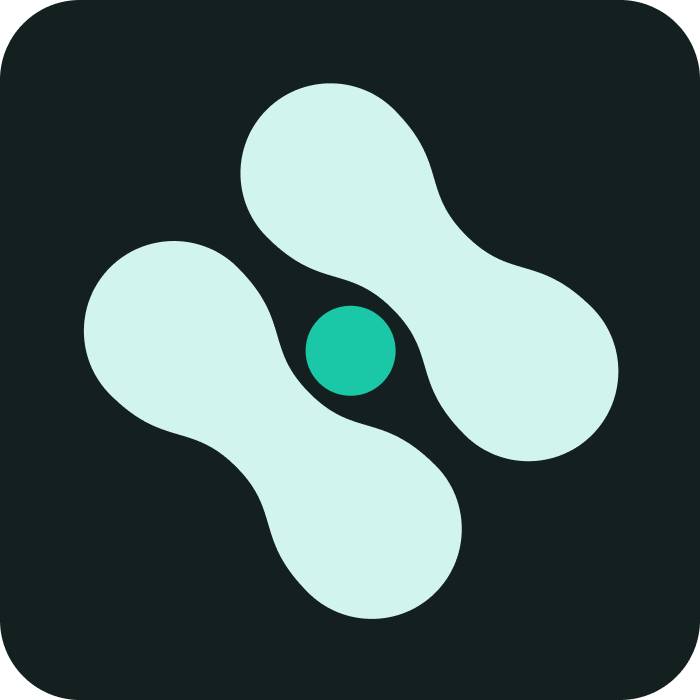
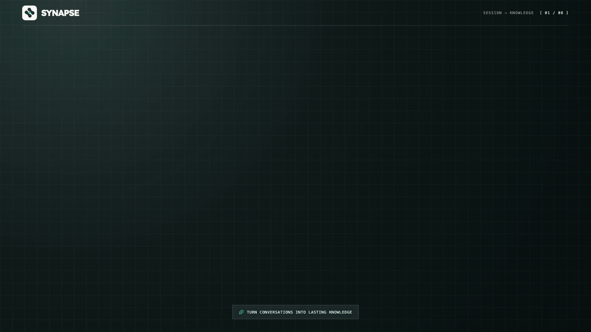

<p align="center">
  <a href="https://github.com/hugozhou-ai/synapse">
    
  </a>
</p>

# Synapse

[](README.zh-CN.md)

Synapse is a local-first Codex task widget and summary workspace for macOS. It observes active and recently completed local tasks through Codex lifecycle Hooks, then uses the local Codex App Server to turn selected turns into editable, searchable, and traceable summaries.

Synapse currently supports macOS only and requires a locally available Codex binary. It does not send task content to a Synapse-operated service; summary generation follows the user's existing Codex configuration and data-handling setup.

> **Project status:** Synapse is in early development. The repository does not currently provide signed and notarized binaries; run it from source or build it locally.

## Product Introduction

[](https://cdn.jsdelivr.net/gh/hugozhou-ai/synapse@master/docs/assets/product-introduction/synapse-product-introduction.mp4)

**[Open the full-resolution product introduction →](https://cdn.jsdelivr.net/gh/hugozhou-ai/synapse@master/docs/assets/product-introduction/synapse-product-introduction.mp4)**

The video shows how Synapse selects factual turns, creates structured content from a reusable template, or merges new facts into an existing document for continued review. The link opens the 1080p MP4 in the browser's native video player, which supports fullscreen playback.

## Workflow

```text
Codex lifecycle Hooks
          ↓
Unix socket / offline spool
          ↓
Local SQLite storage
          ↓
Codex App Server generates a structured draft
          ↓
Edit and finalize → History / Markdown / JSON / Apple Notes / Notion
```

1. Synapse shows active and pending Codex tasks in a global desktop widget.
2. After a task stops, select any combination of turns to use as the factual source.
3. Create a structured summary or merge the selected turns into an existing SQLite summary while preserving its structure, style, and level of detail; the title, abstract, tags, and Markdown body remain editable and previewable.
4. Finalized summaries retain immutable version history and can be exported or published to Apple Notes or Notion.

## Features

- **Global task widget**: Transparent, always on top, and visible across Spaces, with menu bar controls and multi-display position restoration.
- **Reliable Hook ingestion**: Observes `SessionStart`, `UserPromptSubmit`, and `Stop`; writes events to a `0600` offline spool when the Unix socket is unavailable and replays them after recovery.
- **Precise turn selection**: Supports arbitrary multi-selection, Shift-range selection, and drag selection after a roughly 350 ms long press.
- **Structured summaries**: Produces a title, abstract, Markdown body, and tags through a fixed JSON Schema; long conversations are chunked at turn boundaries without silently dropping sources.
- **Existing-content merge**: Searches the complete local archive and folds verified facts into the full target document. Merge mode does not use a summary profile and rejects stale base versions instead of overwriting concurrent edits.
- **Traceable history**: Uses SQLite WAL storage, immutable versions, FTS5 full-text search, and Markdown / JSON export.
- **Explicit Codex references**: Copies or drags a compact immutable `synapse://summary/...` reference into a prompt. The optional bundled plugin exposes one read-only MCP tool and lets Codex request only the smallest useful content layer after that reference is supplied.
- **Apple Notes sync**: New summaries can select an account and folder. A merged document updates its existing bound note only after finalization, and failed publications remain available for explicit retry.
- **Notion publishing**: Synapse calls the connected Notion MCP directly through Codex App Server, creates a page under a configured parent, and updates that same page by its stored page ID on later finals.
- **Least-privilege execution**: Runs the summary agent in a read-only sandbox and an isolated empty directory, with explicit instructions not to call tools, read or write files, or access the network.

## Requirements

- macOS
- Node.js `22.13.0` or later
- A Codex binary available from one of the following:
  - Codex CLI
  - Codex Desktop
  - The Codex binary bundled with ChatGPT Desktop

SQLite uses the `node:sqlite` implementation bundled with both Node.js and Electron, so development, testing, and packaging do not require native module ABI switching.

## Run from source

```bash
git clone https://github.com/hugozhou-ai/synapse.git
cd synapse
npm install
npm run dev
```

## First-time setup

1. On first launch, Synapse opens the setup flow if Hook setup has not been completed or dismissed. You can also open **Settings → Codex Hook** from the widget or menu bar icon.
2. Select **Install Hook**. Synapse backs up and atomically merges `~/.codex/hooks.json`, then enables the canonical `hooks = true` entry under `[features]`.
3. Review the complete commands and all three Hook events in the security confirmation, then select **Trust and Enable**. You can also enter `/hooks` in Codex to inspect their status.
4. Start or resume a Codex task. The widget should show it as active after a prompt is submitted; when the task stops, its card moves to the top and exposes the summary action.
5. Choose turns, then either use a summary profile to create new content or search and merge into existing content without a profile. After editing and finalizing it, the result can be searched, regenerated, or exported from history.

To reference a summary from another Codex task, explicitly install the bundled plugin from **Settings → Codex Reference Plugin**, start a new Codex task, then copy or drag **Reference** from a history detail into the prompt. Installation does not inject summary bodies into new tasks: the read-only MCP server resolves only a reference present in the user's message and returns metadata, an abstract, an outline, one section, or bounded full content as requested by Codex.

To use Apple Notes, choose a target account and folder in Settings, then allow Synapse to control Notes when macOS displays its first permission prompt.

To use Notion, connect and enable the Notion app in Codex first, then enter a parent page URL or page ID under Settings → External publishing. Synapse does not store Notion tokens.

Uninstalling the Hook removes only the Synapse handlers recorded in its manifest. Existing user Hook configuration remains intact.

## Local data and privacy

Synapse stores the complete prompt and assistant content supplied by Hooks, minimal event metadata, and summary versions on the local machine for task tracking and later summarization. Runtime logs do not contain prompts, conversation bodies, or summary bodies.

Markdown stored in SQLite is the sole source of truth for summary content. Apple Notes and Notion are one-to-one, one-way published copies; Synapse does not read or merge edits made directly in either external page.

| Data | Default location |
| --- | --- |
| SQLite database | `~/Library/Application Support/Synapse/synapse.sqlite3` |
| Hook relay | `~/Library/Application Support/Synapse/bin/codex-hook-relay.sh` |
| Unix socket | `~/Library/Application Support/Synapse/run/hook.sock` |
| Runtime log | `~/Library/Application Support/Synapse/logs/synapse.log` |
| Offline events | `~/Library/Application Support/Synapse/spool/` |
| Hook manifest and backups | `~/Library/Application Support/Synapse/` |
| Installed reference plugin | `~/plugins/synapse-reference/` |
| Personal plugin marketplace | `~/.agents/plugins/marketplace.json` |

## Verification and builds

Run the complete quality checks:

```bash
npm run check
npm run build
```

`npm run check` runs TypeScript type checking, architecture dependency checks, and the automated test suite. Tests use a fake App Server, temporary SQLite databases, and a temporary Codex configuration directory; they do not modify the real `~/.codex` directory or consume Codex usage.

Build macOS DMG and ZIP artifacts:

```bash
npm run package:mac
```

Production distribution requires Developer ID signing and notarization credentials in the Electron Builder environment. [`build/entitlements.mac.plist`](build/entitlements.mac.plist) already includes the Apple Events entitlement.

## Architecture

```text
Renderer / Preload / IPC
          ↓
Application Services
          ↓
Domain Aggregates / Domain Services
          ↓
Ports ← Infrastructure Adapters
```

The domain layer has no dependency on Electron, Node.js, SQLite, or external protocols, and the main process is the sole Composition Root. App Server communication uses its stable `stdio` JSONL transport. For implementation details, see:

- [Architecture and domain boundaries](docs/architecture.md)
- [macOS manual verification checklist](docs/manual-verification.md)
- [Codex Hooks documentation](https://learn.chatgpt.com/docs/hooks)
- [Codex App Server documentation](https://learn.chatgpt.com/docs/app-server)
